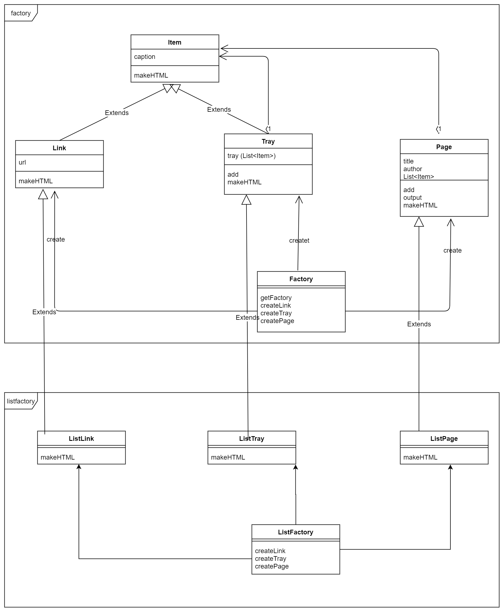
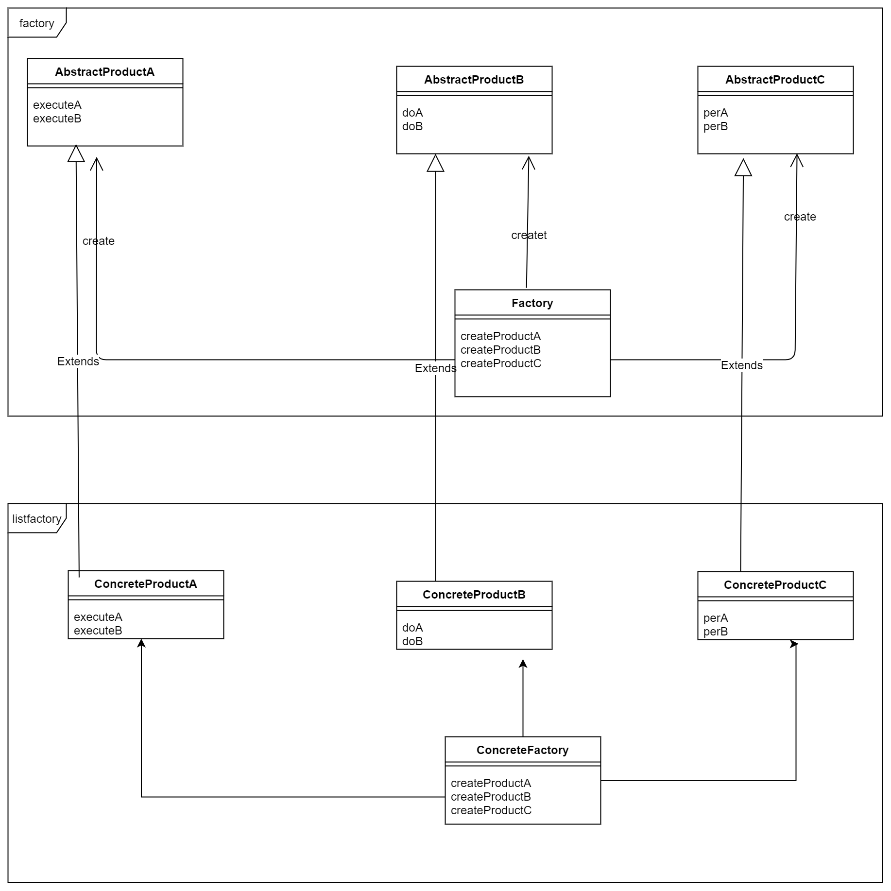

# Abstract Factory(抽象工厂)

> 抽象工厂就是将抽象零件组装成抽象产品 

## 示例程序

包 | 名字 | 说明
---| ---| ---|
factory | Factory | 表示抽象工厂的类(制作Link、Tray、Page)
factory | Item | 方便统一处理Link和Tray的类
factory | Link | 抽象零件:表示HTML的链接的类
factory | Tray | 抽象零件:表示含有Link和Tray的类
factory | Page | 抽象零件:表示HTML页面的类
无 | Main | 测试程序行为的类
listfactory | ListFactory| 表示具体的工厂类
listfactory | ListLink | 具体零件:表示HTML的链接的类
listfactory | ListTray | 具体零件:表示含有Link和Tray的类
listfactory | ListPage | 具体零件:表示HTML页面的类

---

接下来的这幅图看起来有点恐怖，但是只需要记住，抽象工厂是将抽象零件组装成抽象产品 即可。

---

---

## 抽象类图
- AbstractProduct
- AbstractFactory
- Client (源代码中的Main)
- ConcreteProduct
- ConcreteFactory

---

---