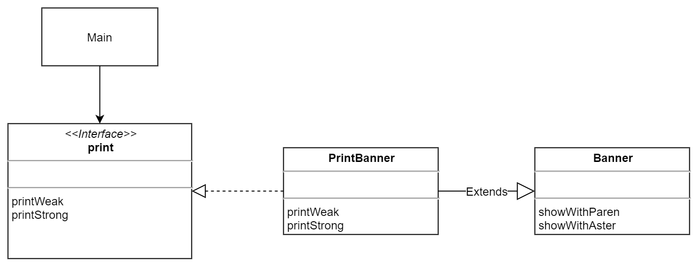
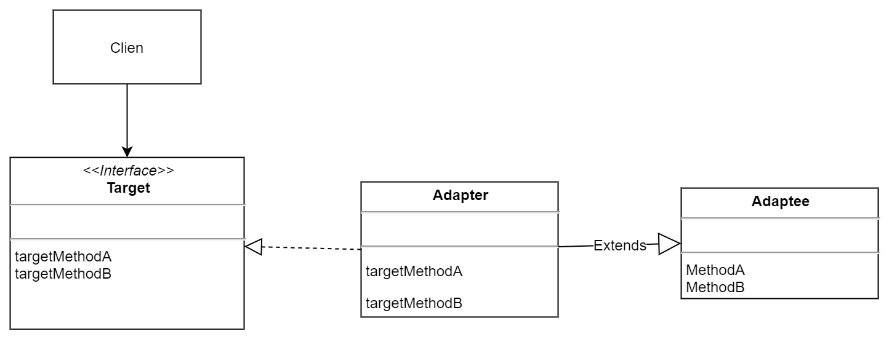
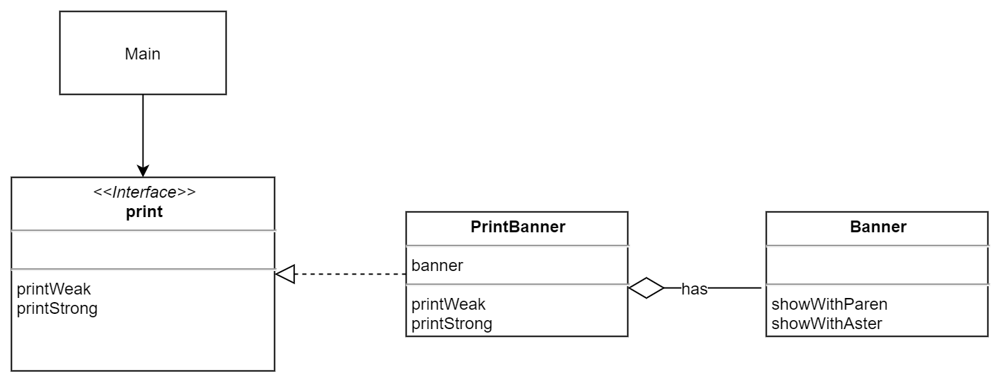
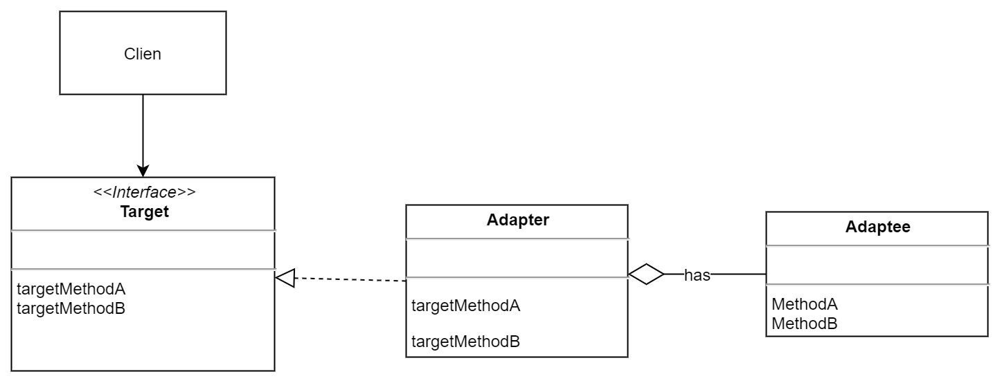

### 类适配器模式(ClassAdapter)
使用一个新的类，来作为适配器。这个类，extends了100伏，然后实现了12伏特接口。

### 对象适配器模式(ObjectAdapter)
使用一个对象，来作为适配器。这个对象包含100伏对象，然后实现了12伏接口。

### 练习题
第一次使用了Properties类，中文上，我愿意称之为「属性类」。本质上感觉是处理键值对的。

### 图片解析

打印机例子
1. Banner 作为最初的数据源，现在被适配
2. PrintBanner extends Banner。作为适配器的具体实现
3. Print则作为抽象的适配器
---

对应的抽象类图

---

这里还可以拓展一下思路，具体适配器不一定要extends被适配的。可以改成**组合**。

---

对应的抽象类图

---

