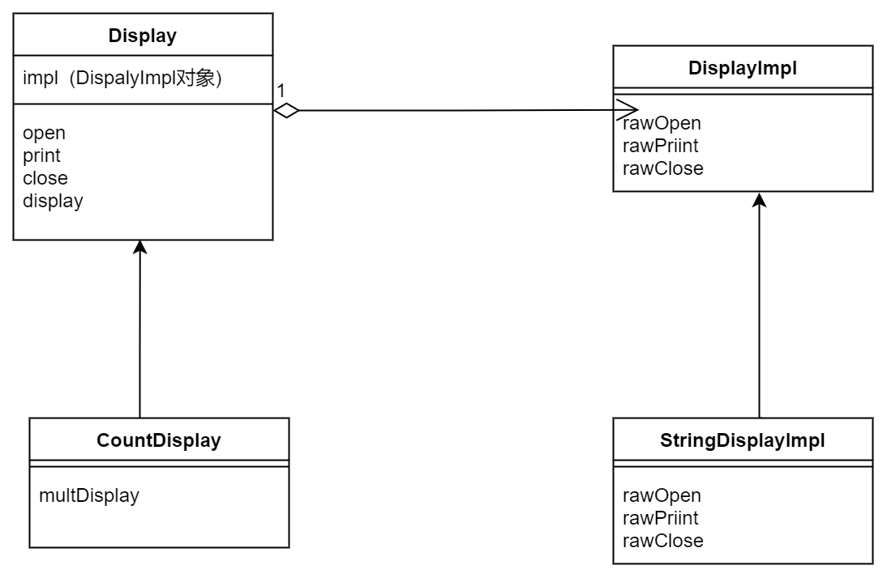
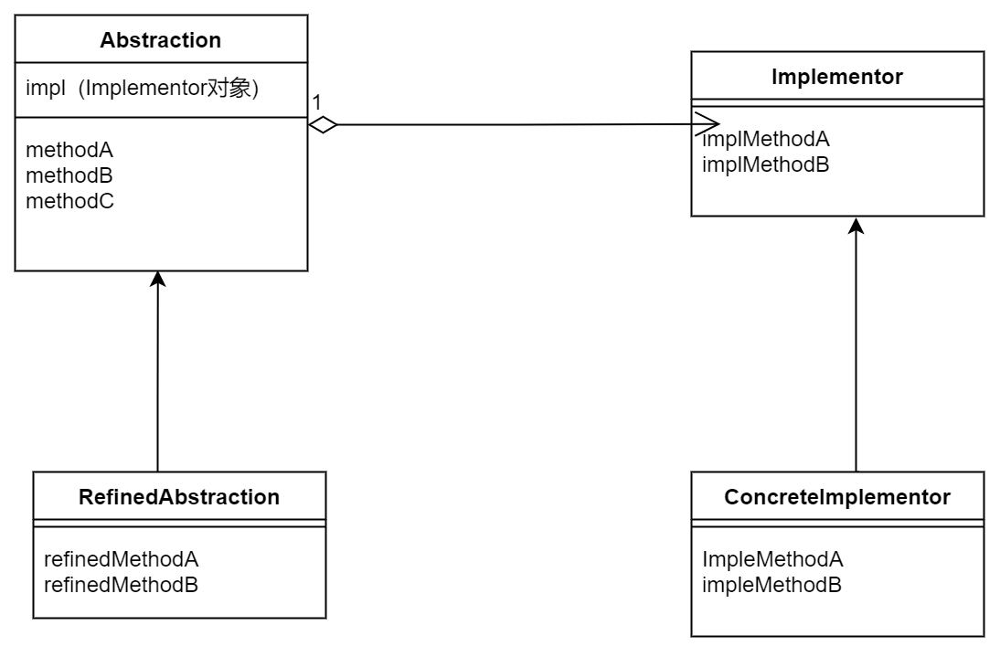

# Bridge
重点需要关注
- 类的功能层次结构
- 类的实现层次结构

> 示例程序类图
在桥的哪一侧 | 名字 | 说明
类的功能层次结构 | Display | 负责“显示”的类
类的功能层次结构 | CountDisplay |  增加了“只显示规定次数”的功能
类的实现层次结构 | DisplayImpl | 负责“显示”的类
类的实现层次结构  | StringDisplayImpl  | "用字符串显示"的类
  | Main  | 测试

---

---

我觉得关键有两个点，**功能继承扩展** ，**接口实现扩展** 。并且这个桥梁是通过一个委托来完成的。
这是我目前觉得，结构最清晰的一种设计模式。相比Template Method 功能与实现上分得更清楚，相比Abstract Factory又显得简单。 

抽象类图
---

---

