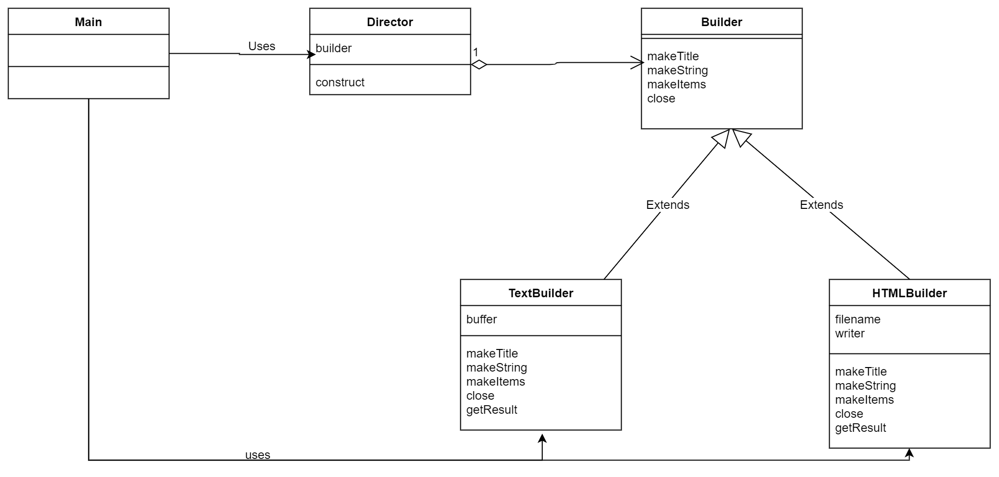
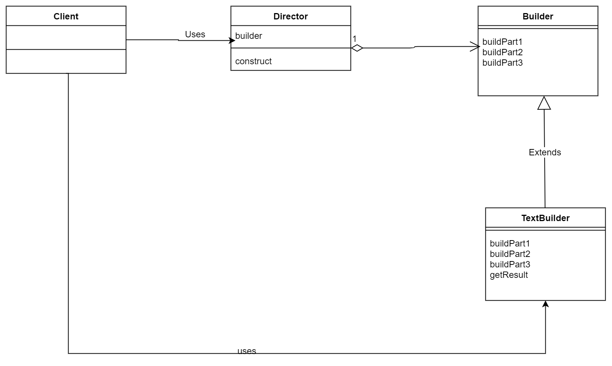
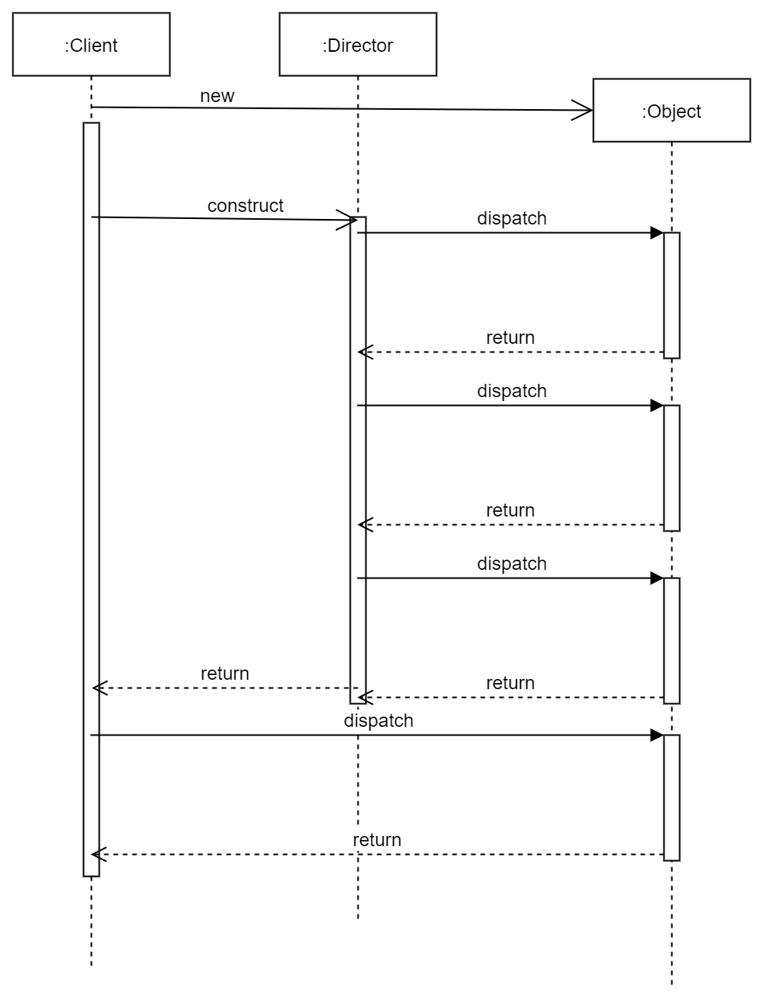

### Builder(建造者模式)
> 例子类图

---

---

**关键**
1. Builder中定义了抽象方法，而真正的算法定义在Dierctor中，这正是与Template method不同的地方。
2. 但是 这种差别是真的大吗？也许是我还没有领会到Builder的妙处。用于组装具有复杂结构的实例 ?

> 抽象类图
---

---

> Builder的时序图

也许看起来会清晰一点，但是 依旧没有解决我心中对Builder和Template method之间的疑惑。

---

---