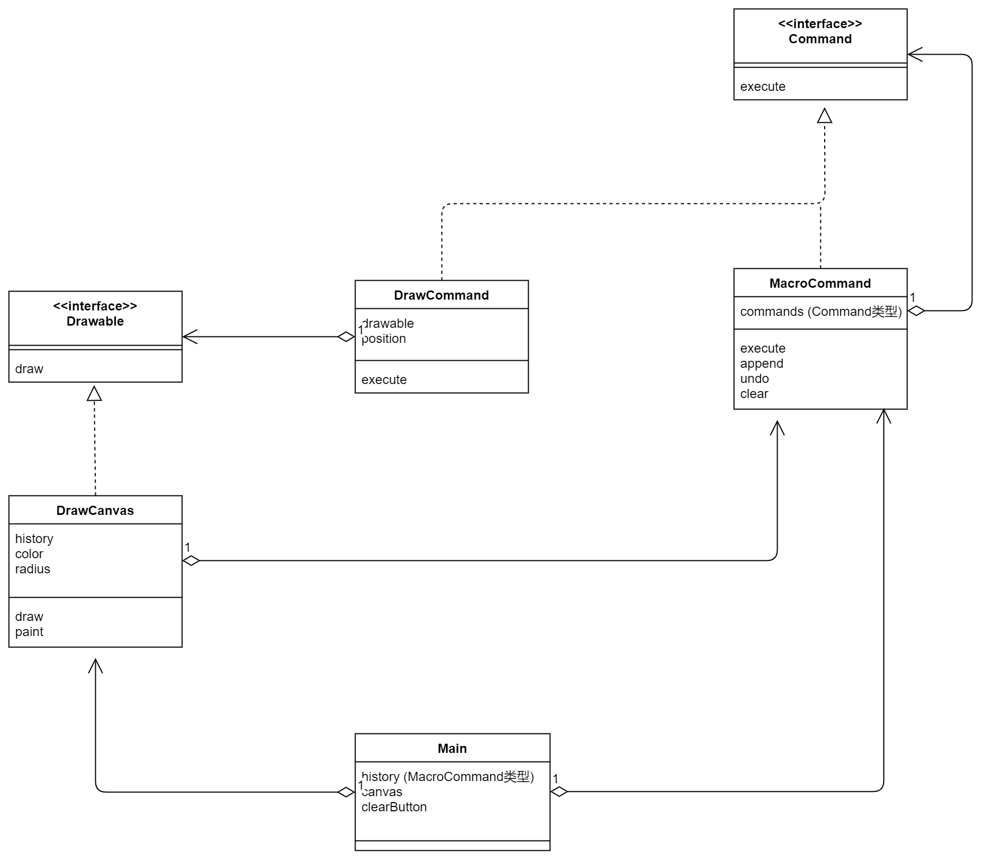

# Command(命令模式)
用类来表示命令。比如当我想管理历史记录时，我只需要管理实例的集合即可。

下面这些文件夹应该单独打开来运行
- [A1](A1)
- [A2](A2)
- [Sample](Sample)

> 示例类图

这是一个画图软件的例子，它的功能很简单，即用户拖动鼠标时程序会绘制出红色圆点，点击clear会清楚所有圆点。注意：我们不去关心红色圆点是怎么画的，只去关心类的构成是怎么样的。

包 | 名字 | 说明
---|---|---|
command | Command | 表示“命令”的接口
command | MacroCommand  | 表示“由多条命令整合成的命令”的类
drawer | DrawCommand | 表示“绘制一个点的命令”的类
drawer | Drawable | 表示“绘制对象”的接口
drawer | DrawCanvas | 实现“绘制对象”的类
无名 | Main | 测试程序行为的类

---


---

看到上图，你大概率会被搞懵，这里主要说一下以下这些类

**`DrawCommand`**
```java
protected Drawable drawable;
// 绘制位置
private Point position;
// 构造函数
public DrawCommand(Drawable drawable, Point position) {
    this.drawable = drawable;
    this.position = position;
}
// 执行
public void execute() {
    drawable.draw(position.x, position.y);
}
```
它主要代表了一个画画的命令，拥有一个Drawable对象

**`DrawCanvas`**
```java
// 颜色
private Color color = Color.red;
// 要绘制的圆点的半径
private int radius = 6;
private MacroCommand history;
public DrawCanvas(int width, int height, MacroCommand history) {
    setSize(width, height);
    setBackground(Color.white);
    this.history = history;
}
// 重新全部绘制
public void paint(Graphics g) {
    history.execute();
}
// 绘制
public void draw(int x, int y) {
    Graphics g = getGraphics();
    g.setColor(color);
    g.fillOval(x - radius, y - radius, radius * 2, radius * 2);
}
```
它是一个Drawable对象，本质上画画的那个操作是由就它完成的，它拥有MacroCommand history，也就是拥有了许多Command命令。

**`MacroCommand`**
```java
private DrawCanvas canvas = new DrawCanvas(400, 400, history);
//注意，其它一些Command里面用的Canvas都是Main里面传过去的

//在使用上，MacroCommand中，可以装许多`Command
private MacroCommand history = new MacroCommand();
public void mouseDragged(MouseEvent e) {
    Command cmd = new DrawCommand(canvas, e.getPoint());
    history.append(cmd);
    cmd.execute();
}
```

看到这里，大概也会懵，`DrawCommand` 有 `Drawable`  ,`Drawable`有`MacroCommand`  ,`MacroCommand`有`DrawCommand`，就好像循环嵌套。**但是我觉得有一个起点，起点就是`DrawCommad`以及它的`execute`** .


`Main.java` 里面的一些GUI我就不说了，不是本书的重点。

> 抽象类图

---


---


登场角色
- Command （命令）
- ConcreteCommand （具体命令）
- Receiver （接收者） 比如DrawCanvas接收 DrawCommand命令
- Client （请求者） 比如Main类，生成了 DrawCanvs和DrawCommand
- Invoker （发动者） 调用DrwaCommand的，比如DrawCanvas和Main
其实说实话，对这个Invoker印象不深刻 

习题
1. 请在示例程序中增加“设置颜色”的功能，就像手中握有多支不同颜色的笔一样，设置了新的颜色后，当拖动鼠标，会画出新颜色的点。新建一个ColorCommand类，用来设置颜色命令 


2. 请在示例程序中增加撤销功能，它的作用是“删除上一次画的点”。
```java
private MacroCommand history = new MacroCommand();
public void mouseDragged(MouseEvent e) {
    Command cmd = new DrawCommand(canvas, e.getPoint());
    history.append(cmd);
    cmd.execute();
}
```
注意：当我鼠标摁下一个键，并且移动了，其实这里会创建许多DrawCommand对象了。当需要重新绘制时，我可以控制一些DrawCommand对象的remove，然后这些DrawCommand是带有Position的，让这些DrawCommand调用DrawCanvas的repaint就可以达到撤销的效果了。