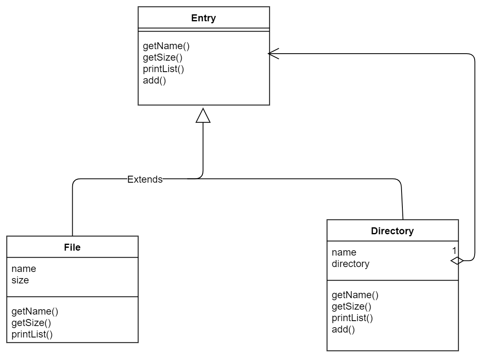
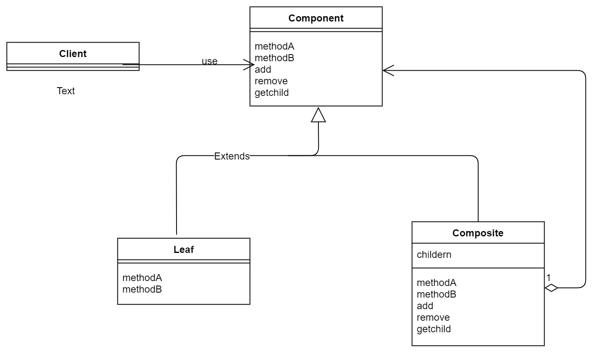

# Composite(混合模式)
书上对混合模式的描述是这样的，容器中既可以放入内容，也可以放入小容器 ，这就是混合。之所以能混合，是因为容器与内容的一致性 。
在示例程序中，这种一致性表现为，继承于同一个类。

> 示例类图


---


---

类 | |
-----|-----
Entry |抽象类，用来实现File类和Directory类的一致性
File | 表示文件的类
Directory | 表示文件夹的类
FileTreatmentException | 表示向文件中增加Entry时发生的异常的类
Main | 测试程序的类


文件夹中的递归调用 
```java
public int getSize() { // 获取大小
    int size = 0;
    Iterator<Entry> it = directory.iterator();
    while (it.hasNext()) {
        Entry entry = (Entry) it.next();
        size += entry.getSize();
    }
    return size;
}
```

如何控制文件不能添加Entry?
只要让File不要重写add方法即可，这样File调用的就是Entry的add方法。
```java
public Entry add(Entry entry) throws FileTreatmentException {   // 加入目录条目
    throw new FileTreatmentException();
}
```


> 抽象类图

---


---

- Leaf (树叶)
表示内容
- Composite(混合物)
表示容器，可以放入Leaf和Composite
- Component
让Leaf和Composite具有一致性的抽象类
- Client
使用者，示例中的Main