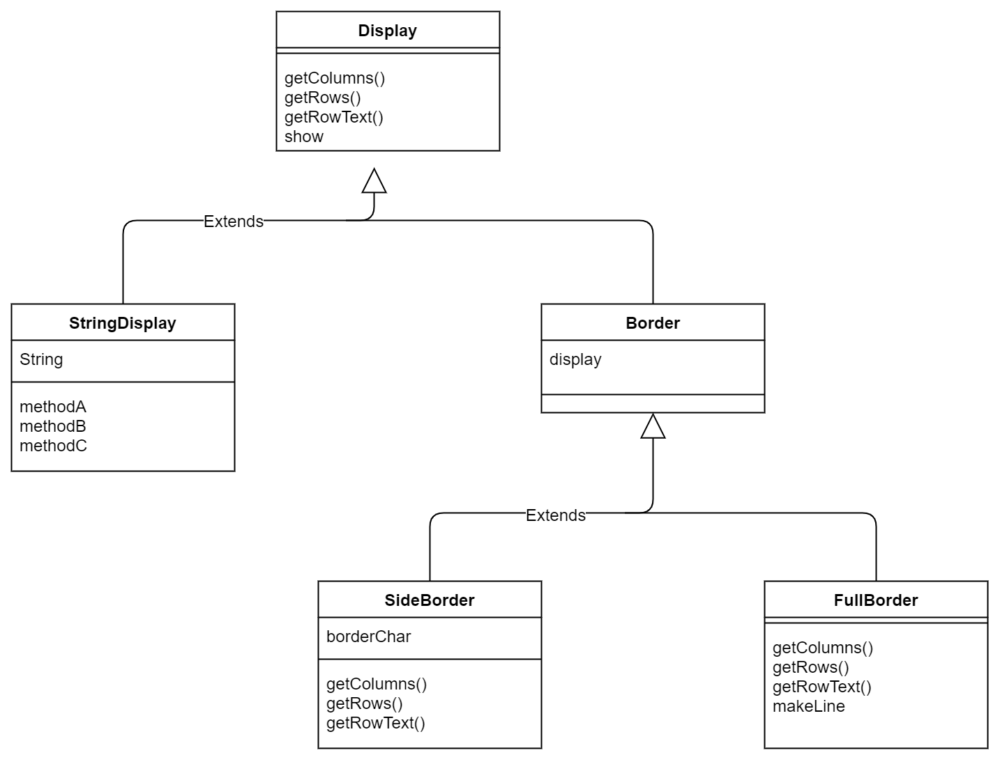
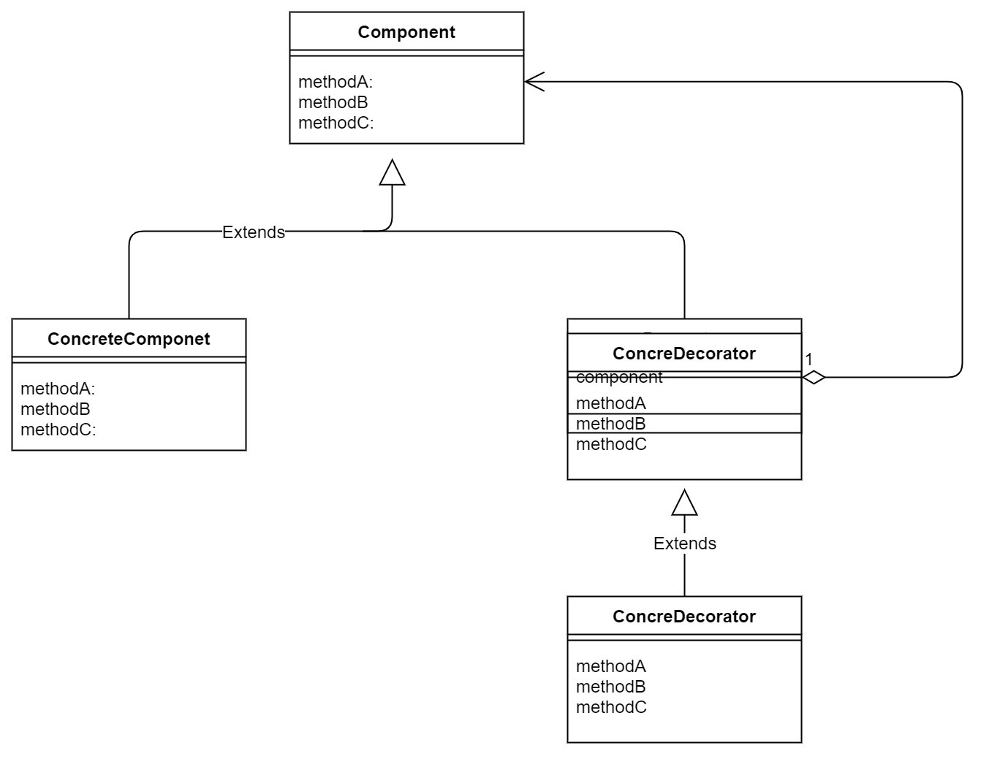

## Decorator(装饰者模式)

重点需要关注
- 有被装饰物和装饰物的关系
- 被装饰物与装饰物都继承于同一个类。书上的解释是，这样的一致性就可以实现，被装饰物又可以变成装饰物。


名字 | 说明 | 
-----|------|
Display |用于显示字符串的抽象类 
StringDisplay | 用于显示单行字符串的类
Border | 用于显示装饰边框的抽象类(继承于Display)
SideBorder | 用于只显示左右边框的类 
FullBorder | 用于显示上下左右边框的类
Main | 测试程序的主类
---

> 示例类图 

---


---


> 抽象类图
---


---

**补充**

装饰者模式中，最刷新我认知的点就是，装饰者和被装饰 的一致性。书上解释说，这样体现了一个接口的透明性，这点倒是没有太懂，但是最直接的一个体现，就是，被装饰者可以轻松转化成装饰者。

> 委托-自己和被委托对象的一致性
没有一致性的委托

```java
class Rose{
    Violet obj  = ...
    void method (){
        obj.method();
    }
}

class Violet(){
    void method(){
    }
}
```


有一致性的委托(**继承实现**)
```java
abstract class Flower{
    abstract void method();
}

class Rose extends Flower{
    Violet obj = ....
    void method (){
    obj.method();
    }
}

class Violet extends Flower{
    void method(){
    }
}
```

有一致性的委托(**接口实现**)
```java
interface Flower{
abstract void method();
}

class Rose implements Flower{
    Violet obj = ....
    void method (){
    obj.method();
    }
}

class Violet implements Flower{
    void method(){
    }
}
```
