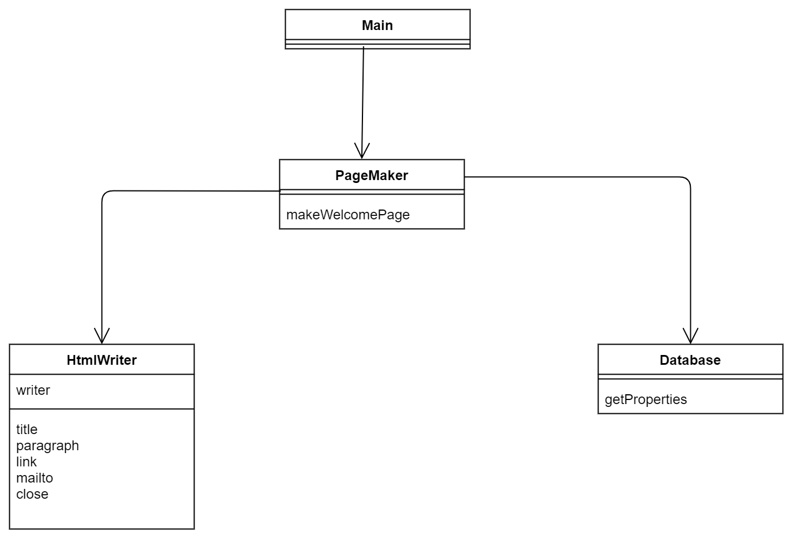
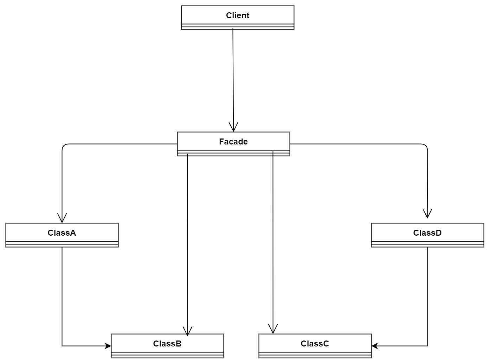

# Facade(外观模式)
> 读音[fəˈsɑːd]  我更喜欢称之为，API模式

为什么叫它API模式？因为它真的只对外开放了简洁的API。不像Abstract Factory那样，要自己组装零部件。

> 示例类图

包 | 名字 | 说明
----|-----|-----
pagemaker | Database |从邮件地址中获取用户名的类
pagemaker | HtmlWriter | 编写Html文件的类
pagemaker | PageMaker |根据邮件地址编写用户的Web页面
无 | Main |测试程序行为的类

---


---

**补充：**

里面用到Java的Properties，这里把代码贴一下
```java
Properties prop = new Properties();
try {
    prop.load(new FileInputStream(filename));
} catch (IOException e) {
    System.out.println("Warning: " + filename + " is not found.");
}
```
```java
 Enumeration en = mailprop.propertyNames();
```

1. 如何从文件读取key-value到Properties
2. 如何从Properties中抽取数据


抽象类图

---


---