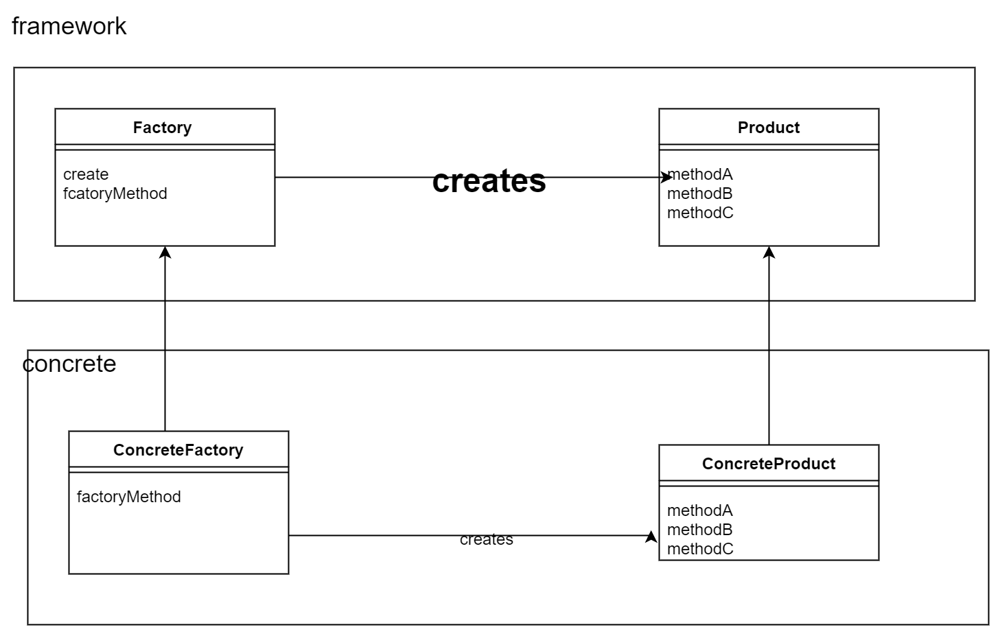

### Factory Method模式(工厂方法模式)

回顾一下 Template Method ，它是在抽象类里面定义了抽象方法，以及算法，然后子类就实现抽象方法。

Factory Method 在Template Method的基础上，多了创建对象的责任。它在抽象类里面定义了抽象方法，以及算法，算法里面包括了创造一个对象。

需要注意的是，创造Product的子类的构造方法是 Default，这就确保了在包外，只能通过Factory的子类来创建。

> 示例程序类图
---

---
关键 (将实例的生成交给子类)
- Template Method的关键点，父类的AbstractMethod，templateMethod
- templateMethod中要用到对象，所以所以子类要创建实例

>抽象类图
---

---