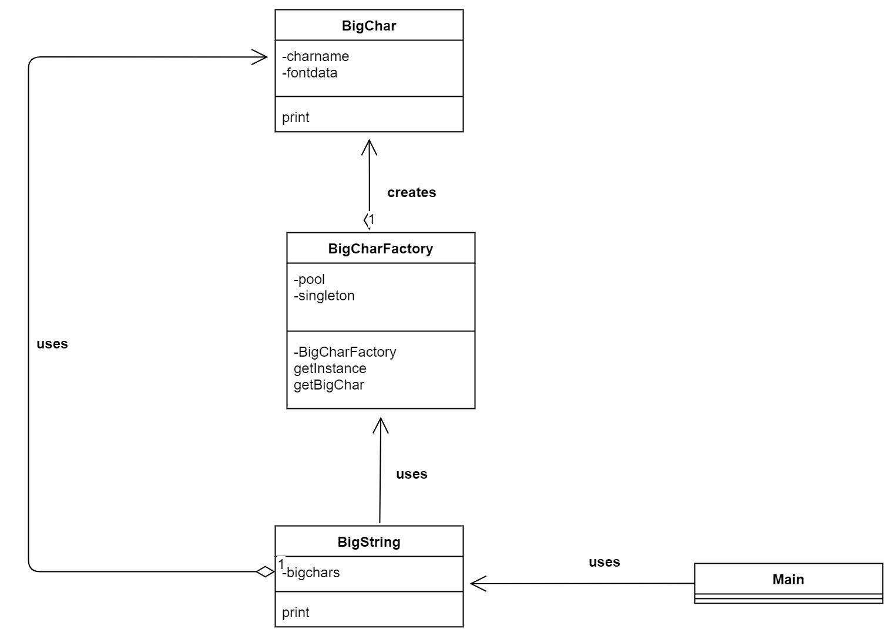
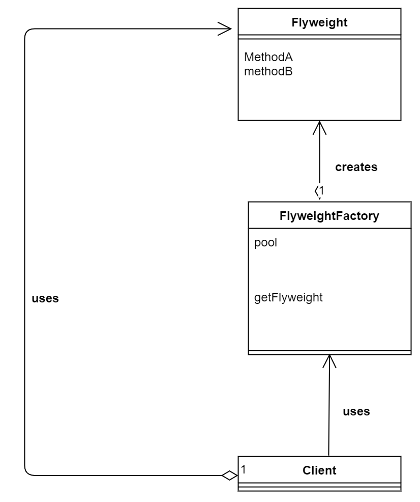

# Flyweight(轻量级模式)
> 感觉这个译文不够适合

**口述**

把变量共享起来了，可以重用的都共享起来了。这样就可以减少一些内存等其它性能方面的东西。

> 示例类图

名字 | 说明
-----|----
Bigchar | 表示大型字符的类
BigCharfactory | 表示生成和共用Bigchar类的实例类(就是工厂类 )
BigString | 表示多个BigChar组成的大型字符串类
Main | 测试程序行为的类

---

----

**一些流**

**通过FileReader套上BufferReader**
```
BufferedReader reader = new BufferedReader(new FileReader("big" + charname + ".txt"));
```

**Factory本质是单例模式的体现**
```
private static BigCharFactory singleton = new BigCharFactory();
```

**实例池可以用Hashmap实现**
```
private HashMap<String, BigChar> pool = new HashMap<>();

public synchronized BigChar getBigChar(char charname) {
    BigChar bc = (BigChar) pool.get("" + charname);
    if (bc == null) {
        bc = new BigChar(charname); // 生成BigChar的实例
        pool.put("" + charname, bc);
    }
    return bc;
}
```

> 抽象类图

---

---

- Flyweight 

表示会被共享的实例
- FlyweightFactory

工厂类，由工厂获取实例。
- Client

请求者


**补充**

> 书上补充了一个例子，来测试共享变量与不共享变量，对JVM内存的影响。主要修改了以下两个类。

**`BigString.java`**

> 关键是否把变量存到Hashmap中
```
public class BigString {
    // 大型文字的数组
    private BigChar[] bigchars;
    // 构造函数
    public BigString(String string) {
        initShared(string);
    }
    // 构造函数
    public BigString(String string, boolean shared) {
        if (shared) {
            initShared(string);
        } else {
            initUnshared(string);
        }
    }
    // 共享方式初始化
    private void initShared(String string) {
        bigchars = new BigChar[string.length()];
        BigCharFactory factory = BigCharFactory.getInstance();
        for (int i = 0; i < bigchars.length; i++) {
            bigchars[i] = factory.getBigChar(string.charAt(i)); 
        }
    }
    // 非共享方式初始化
    private void initUnshared(String string) {
        bigchars = new BigChar[string.length()];
        for (int i = 0; i < bigchars.length; i++) {
            bigchars[i] = new BigChar(string.charAt(i));    
        }
    }
    // 显示
    public void print() {
        for (int i = 0; i < bigchars.length; i++) {
            bigchars[i].print();
        }
    }
}
```

**`Main.java`**

> 关键是一个Runtime类的使用
```
public class Main {
    private static BigString[] bsarray = new BigString[1000];
    public static void main(String[] args) {
        System.out.println("共享时:");
        testAllocation(true);
        System.out.println("非共享时:");
        testAllocation(false);
    }
    public static void testAllocation(boolean shared) {
        for (int i = 0; i < bsarray.length; i++) {
            bsarray[i] = new BigString("1212123", shared);
        }
        showMemory();
    }
    public static void showMemory() {
        Runtime.getRuntime().gc();
        long used = Runtime.getRuntime().totalMemory() - Runtime.getRuntime().freeMemory();
        System.out.println("使用内存 = " + used);
    }
}

```