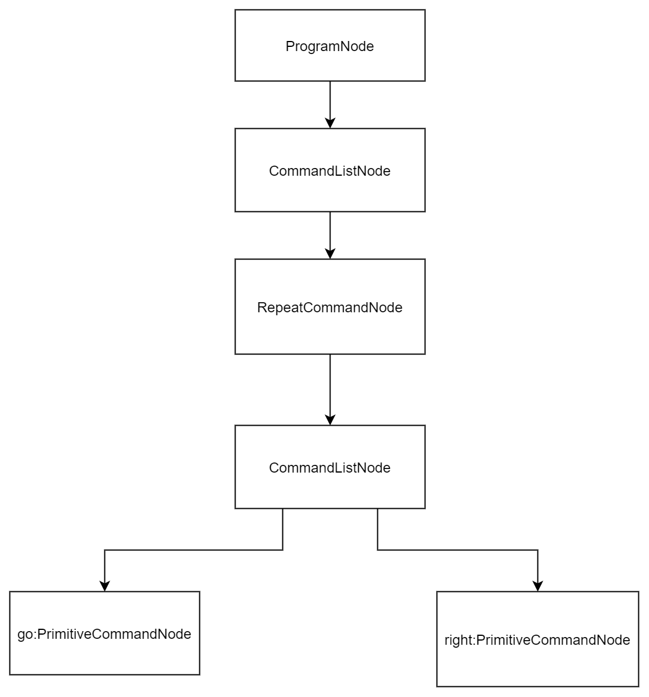
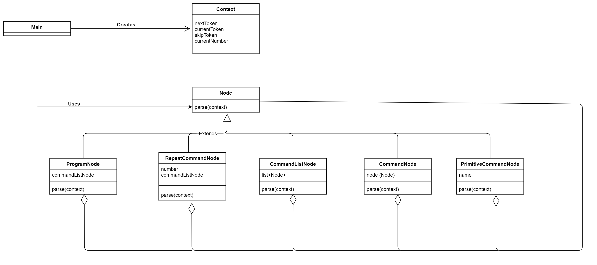
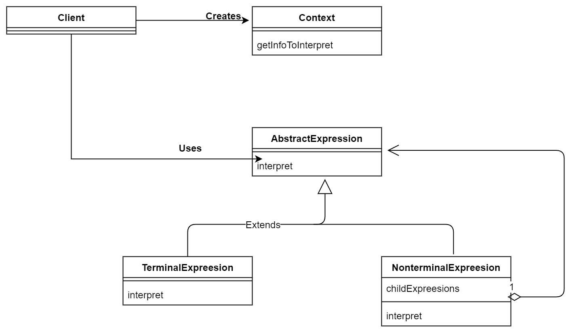
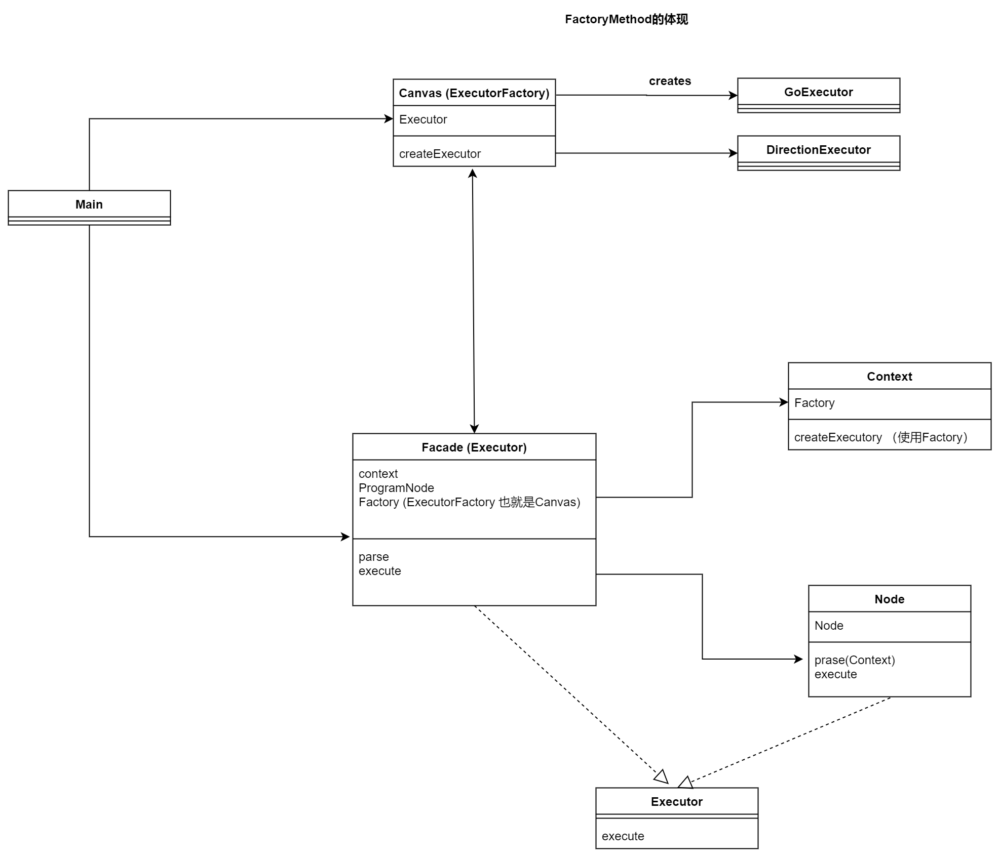

# Interpreter(拦截器模式)

**口述:** 

给我的感觉就是请求要经过各种拦截器，就像命令解析那样。(算了我也很难解释清楚，觉得它和Proxy很像)

> 示例类图

这个示例主要实现了一个语法解释器 ，给我一条命令，通过示例程序就可以解释并执行。语法规则是这样的。
1. 以 program 开头，以end结尾
2. 具体的命令有 go right left repeat 这些命令可以连续使用。
3. repeat 的命令格式为repeat number [第二点中的命令] end 

**下面是一些命令的例子，基本可以看懂它的语法规则**
```text
// program repeat 4 go right end end
program 
    repeat
        4
        go
        right
    end
end
```
```text
//program repeat 4 repeat 3 go right go left end right end end
program
    repeat
        4
        repeat
            3
            go
            right
            go
            left
        end
        rigth
    end
end
```

这个程序以什么的形式表达输入的命令已经经过了解释呢？
它会把同一层的命令用中括号括起来。repeat就会多嵌套一层嘛
```text
text = "program end"
node = [program []]
text = "program go end"
node = [program [go]]
text = "program go right go right go right go right end"
node = [program [go, right, go, right, go, right, go, right]]
text = "program repeat 4 go right end end"
node = [program [[repeat 4 [go, right]]]]
text = "program repeat 4 repeat 3 go right go left end right end end"
node = [program [[repeat 4 [[repeat 3 [go, right, go, left]], right]]]]
```

## 语法树

---


---


名字 | 说明
-----|----- 
Node | 表示语法树“节点”的类
ProgramNode | 对应<program>的类
CommandListNode | 对应<command list>的类
CommandNode | 对应<command>的类
RepeatCommandNode | 对应<repeat command>的类
PrimitiveCommandNode | 对应<primitive command>的类
Context | 表示语法解析上下文的类
ParseException | 表示语法解析中可能会发生异常的类
Main | 测试程序行为的类

---


---


### `Context` 到底是什么？
在看Context之前，先看一下Main是如何运行的。
```java
public static void main(String[] args) {
    try {
        BufferedReader reader = new BufferedReader(new FileReader("program.txt"));
        String text;
        while ((text = reader.readLine()) != null) {
            System.out.println("text = \"" + text + "\"");
            Node node = new ProgramNode();
            node.parse(new Context(text));
            System.out.println("node = " + node);
        }
        reader.close();
    } catch (Exception e) {
        e.printStackTrace();
    }
}
```

可以看到解析的起点是node.parse(new Context(text));。context主要表示字符串上下文的作用，比如我现在解释到text的哪一个字符串了，下一个字符串是什么。

### `Context`的方法
名字 | 说明
----|----
NextTOken | 获取下一个标记(前进至下一个标记)
currentToken | 获取当前的标记(不会前进到下一个标记)
skipToken | 先检查当前标记，然后获取下一个标记(前进至下一个标记)
currentNumber | 获取当前标记对应的数值(不会前进至下一个标记， )

**skipToken 在哪些地方被使用了**

先看以下skipToken是怎么样的
```java
//Context.java
private String currentToken;
public Context(String text) {
    tokenizer = new StringTokenizer(text);
    nextToken();
}
public String nextToken() {
    if (tokenizer.hasMoreTokens()) {
        currentToken = tokenizer.nextToken();
    } else {
        currentToken = null;
    }
    return currentToken;
}
public void skipToken(String token) throws ParseException {
    if (!token.equals(currentToken)) {
        throw new ParseException("Warning: " + token + " is expected, but " + currentToken + " is found.");
    }
    nextToken();
}
```
可以看到，currentToken在程序构造方法之后，肯定会指向第一个单词，一般期望是Program。

**skipToken在这里被使用了**
```java
//ProgramNode.java
public void parse(Context context) throws ParseException {
    context.skipToken("program");
    commandListNode = new CommandListNode();
    commandListNode.parse(context);
}

//RepeatCommandToken.java
public void parse(Context context) throws ParseException {
    context.skipToken("repeat");
    number = context.currentNumber();
    context.nextToken();
    commandListNode = new CommandListNode();
    commandListNode.parse(context);
}
```

从这里我们大致可以判断出，skipToken是用来判断currentToken是否等同于输入的Token。具体体现在，程序的一开头要去判断是不是program开头，repeatCommand要去判断是不是repeat开头。太神奇了，写出了一个很通用的办法，而大家只要通用地去执行也很统一地完成了一项功能 。


### `parse`不停调用`parse`，那到底在哪里停止？ 
```java
//ProgramNode.java
public void parse(Context context) throws ParseException {
    context.skipToken("program");
    commandListNode = new CommandListNode();
    commandListNode.parse(context);
}

//PrimitiveCommandNode.java
public void parse(Context context) throws ParseException {
    //我也还想吐槽以下，下面两行代码是不是显得冗余，从Context那里拿了个name，又把name交去检查
    name = context.currentToken();
    context.skipToken(name);
    if (!name.equals("go") && !name.equals("right") && !name.equals("left")) {
        throw new ParseException(name + " is undefined");
    }
}
```
正如语法树 显示地一样，当我们的命令一直往下走，遇到基本的命令 PrimitiveCommandNode时，就会执行真正的基本操作。其次这也符合我们的逻辑，那些循环都是一些逻辑结构，真正执行操作的是一些具体的基本的命令。

> 抽象类图

---

---

**登场角色** 
- AbstractExpreesion (抽象表达式)
- TerminalExpreesion (终结符表达式)
- NonterminalExpreesion (非终结符表达式)
- Context (上下文)
- Client (请求者)

## 综合性例子
> 作为本书的最后一个例子，作者给我们提了个要求，把Interpreter模式的示例按照以下要求改进
1. 使用GUI显示基本命令 的运行结果
2. 使用Facade模式(第15章)使解释器更易于使用
3. 编写一个生成基本命令的类(Factory Method模式)
4. 将解释器的相关代码单独整理至一个包中

**说实话，看到第2、3点有点懵，Facade被我称为API模式，那什么应该成为API？用Factory来生成命令吗？是指递归地完成一行文本串转换成嵌套的CommandNode**

**参考答案的类构成**
包 | 类 |说明
---|----|----
language | InterpreterFacade | 使解释器更好用的类(Facade模式中的Facade角色)
language | ExecutorFactory | 生成基本命令的接口(Factory Method模式中的Creator角色)
language | Context| 与示例相同
language | Node | 与示例相同
language | Executor | 表示“运行”的接口
language | ProgramNode | 与示例相同
Language | CommandNode | 与示例相同
language | PrimitiveCommandNode | 与示例相同
language | RepeatCommandNode | 与示例相同
Language | ExecuteException | 运行时的异常类
language | ParseException | 语法解析时的异常类
turtle | TurtleException | 实现绘图的类(Factory Method中的ConcreteCreator角色)
turtle | TurtleExecutor | (内部类)
turtle | GoExecutor | (内部类)
turtle | DirectionExecutor | (内部类)
无名 | Main | 测试程序行为的类

### 还是先从Main开始了解 

```java
//Main.java
private TurtleCanvas canvas = new TurtleCanvas(400, 400);
private InterpreterFacade facade = new InterpreterFacade(canvas);
private TextField programTextField = new TextField(
        "program repeat 4  repeat 3 go right go left end  right end end");
        
//Constructor()  
//我进行了一个删减，去掉关于GUI方面的代码，全部的代码还是可以在源代码中看见的
public Main(String title) {
    super(title);
    canvas.setExecutor(facade);
    parseAndExecute();
}

private void parseAndExecute() {
    String programText = programTextField.getText();
    System.out.println("programText = " + programText);
    facade.parse(programText);
    canvas.repaint();
}
```

**之前为命令添加中括号的功能，现在代码构成上有什么变化吗?**
```java
//Main.java中
private InterpreterFacade facade = new InterpreterFacade(canvas);
facade.parse(programText);
```

这个facade可以说是把之前的功能封装成了一个API，但我们还是想深入了解API是怎么构成的。
```java
//InterpreterFacade.java部分代码
private Context context;
private Node programNode;
public boolean parse(String text) {
    boolean ok = true;
    this.context = new Context(text);
    this.context.setExecutorFactory(factory);
    this.programNode = new ProgramNode();
    try {
        programNode.parse(context);
        System.out.println(programNode.toString());
    } catch (ParseException e) {
        e.printStackTrace();
        ok = false;
    }
    return ok;
}
```
从这里我们可以看出，把text传进来之后，就和之前示例一样，从program开始执行下去创建各个节点。

### `InterpreterFacade`为什么要实现`Executor`接口 ？除了`Main`使用`Facade`，还有谁使用？
```java
//Main.java
private TurtleCanvas canvas = new TurtleCanvas(400, 400);
canvas.setExecutor(facade);
```

**我发现canvas(画笔)使用了API，那这支画笔是怎么使用API的，把API当作一个Executor？**
```java
//TurtleCanvas.java
public void paint(Graphics g) {         
    initialize();                       
    if (executor != null) {             
        try {                           
            executor.execute();         
        } catch (ExecuteException e) {  
        }                               
    }                                   
}  

public void execute() throws ExecuteException {
    try {
        programNode.execute();
    } catch (ExecuteException e) {
        e.printStackTrace();
    }
}
```


### `InterpreterFacade`中的`factory`是干嘛的？
```java 
//InterpreterFacade的parse()
this.context = new Context(text);
this.context.setExecutorFactory(factory);

//InterpreterFacade.java
public class InterpreterFacade implements Executor {
    private ExecutorFactory factory;
    private Context context;
    private Node programNode;
    public InterpreterFacade(ExecutorFactory factory) {
        this.factory = factory;
    }
    public void execute() throws ExecuteException {
        try {
            programNode.execute();
        } catch (ExecuteException e) {
            e.printStackTrace();
        }
    }
}
```

### 由`InterpreterFacade`可以知道`context`是有一个`Factory`属性的，那来看一个这个`Context`使用了工厂干了什么？

**`Context`**
```java 
//context.java
private ExecutorFactory factory;
public void setExecutorFactory(ExecutorFactory factory) {
    this.factory = factory;
}
public Executor createExecutor(String name) {
    return factory.createExecutor(name);
}
```

原来`Context`使用了`ExecutorFactory`去创建`Executor`

**那谁需要`Executor`呢?**

```java 
//PrimitiveComand.java
public void parse(Context context) throws ParseException {
    name = context.currentToken();
    context.skipToken(name);
    executor = context.createExecutor(name);
}
public void execute() throws ExecuteException {
    if (executor == null) {
        throw new ExecuteException(name + ": is not defined");
    } else {
        executor.execute();
    }
}
```

```java
//RepeatCommandNode.java
public void parse(Context context) throws ParseException {
    context.skipToken("repeat");
    number = context.currentNumber();
    context.nextToken();
    commandListNode = new CommandListNode();
    commandListNode.parse(context);
}
public void execute() throws ExecuteException {
    for (int i = 0; i < number; i++) {
        commandListNode.execute();
    }
}
```
查看了一下语法树上的节点代码，最终`Context`中的`Factory`会被`PrimitiveCommandNode`使用。

### 为什么有下面几个类 ？
这些实例代表了Canvas如何画画的基本操作，就如同之前命令的go,right,left
```java
//TurtleCanvas.java
abstract class TurtleExecutor implements Executor {
    protected TurtleCanvas canvas;
    public TurtleExecutor(TurtleCanvas canvas) {
        this.canvas = canvas;
    }
    public abstract void execute();
}

class GoExecutor extends TurtleExecutor {
    public GoExecutor(TurtleCanvas canvas) {
        super(canvas);
    }
    public void execute() {
        canvas.go(TurtleCanvas.UNIT_LENGTH);
    }
}

class DirectionExecutor extends TurtleExecutor {
    private int relativeDirection;
    public DirectionExecutor(TurtleCanvas canvas, int relativeDirection) {
        super(canvas);
        this.relativeDirection = relativeDirection;
    }
    public void execute() {
        canvas.setRelativeDirection(relativeDirection);
    }
}
```

```java
//TurtleCanvas.java
public Executor createExecutor(String name) {
    if (name.equals("go")) {
        return new GoExecutor(this);
    } else if (name.equals("right")) {
        return new DirectionExecutor(this, RELATIVE_DIRECTION_RIGHT);
    } else if (name.equals("left")) {
        return new DirectionExecutor(this, RELATIVE_DIRECTION_LEFT);
    } else {
        return null;
    }
}
```
之前谈到`PrimitiveCommandNode`是终结符，是最基本的命令。而代码中也是在`PrimitiveCommandNode`中用`Canvas`的`createExecutor()`来生成上面这些类的实例。


至此，我已经大概了解了程序的结构，可以看一下下面的UML图。(可能你看上面的各种标题会很懵，但是没问题可以简单看一下UML图)

---

---

看到Canvas和Facade的互相引用，你可能感觉有点懵。
先看一下它们的调用顺序
```java
//main.java
facade.parse(programText);
canvas.repaint();
```
- 先是facade去执行命令的解析，最终到终结符的时候，也会生成`GoExecutor`和`DirectionExecutor`给`Canvas`使用。(这是用到`Canvas`中的`Factory`)
- canvas再去调用repaint，也就是paint()中的`executor = InterpreterFacade`去执行`execute()`。

**总之，回到之前的问题，我应该已经能够解答了** 

- `Facade`被我称为API模式，那什么应该成为API？
- 用`Factory`来生成命令吗？是指递归地完成一行文本串转换成嵌套的`CommandNode`。

一个总的框架是使用API模式，而`Factory Method`则是用来创建GO和Direction的类。至于使用Interpreter是如何增加新功能的，我们是依旧是通过Context把Factory传递下来，这样就可以让终结符去获取更多外界的信息。