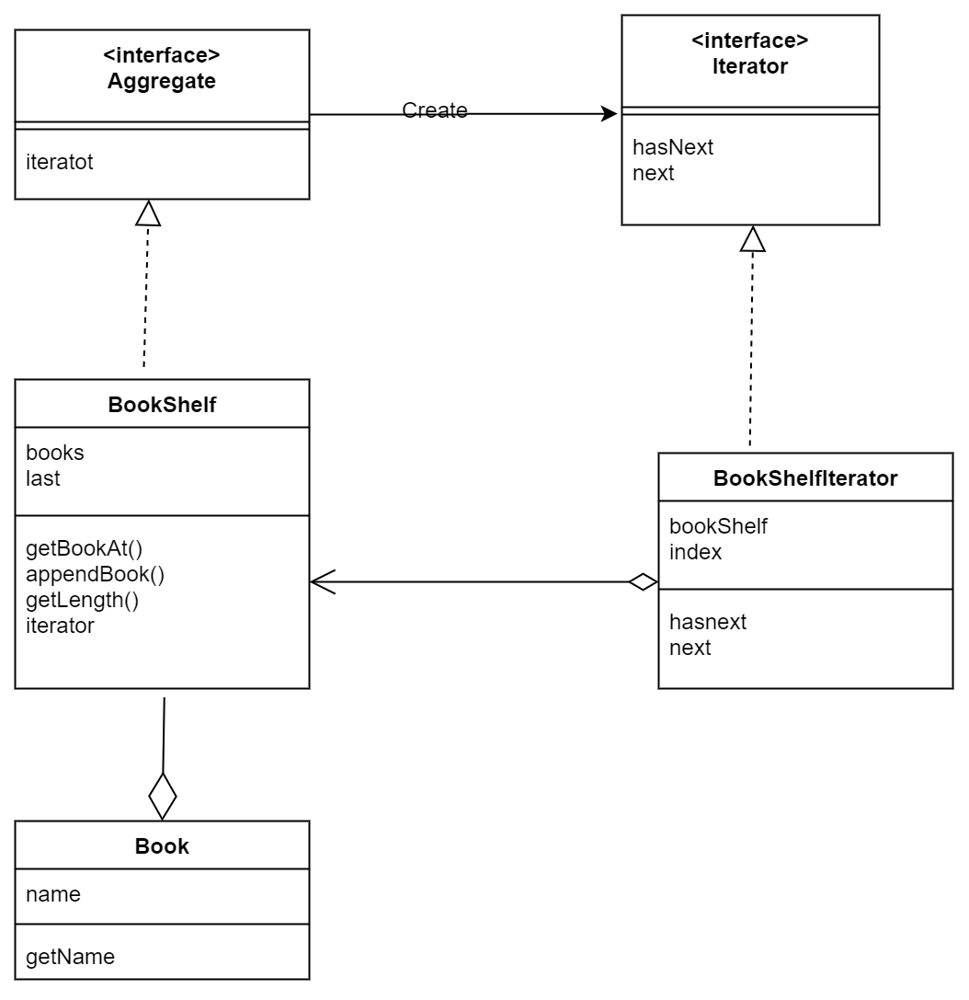
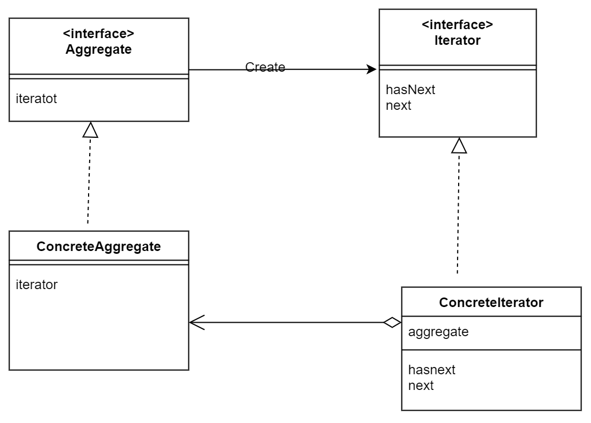

# Iterator(迭代器模式)

具体例子的类图

---

---

Iterator模式中登场的角色
> 1. Iterator(迭代器)
> 2. ConcreteIterator(具体的迭代器)
> 3. Aggregate(集合)
> 4. ConcreteAggregate(具体的集合)

让我想了很久的是，为什么要有Aggregate这个角色。应该是想抽象起来，ConcreteAggregate都实现这个接口的话，就必然会有Iterator了。

---

---