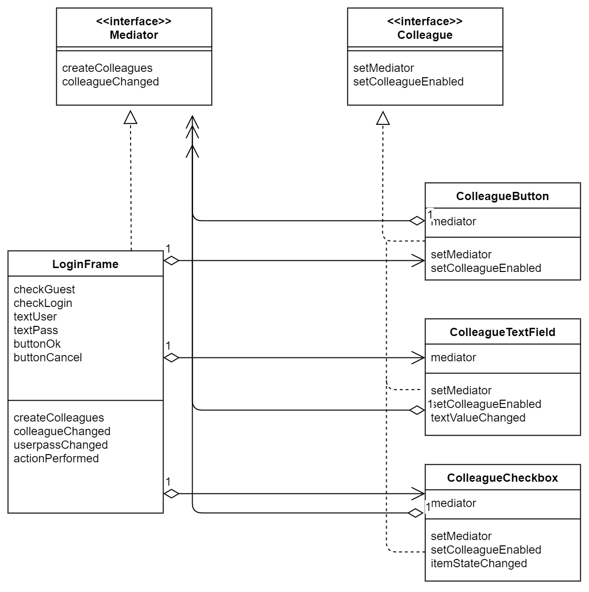

# Mediator(仲裁者模式)
**口述**

Mediator模式，组员向仲裁者报告，仲裁者向组员下达指示。**为的就是减少组员之间的复杂交流**

> 示例类图

名字 | 说明
Mediator | 定义“仲裁者”的接口API的接口
Colleague | 定义“组员”的接口API的接口
ColleagueButton | 表示按钮的类。实现了Colleague
ColleagueTextField | 表示文本输入框的类。实现了Colleague
ColleagueCheckbox  | 表示勾选框。实现了Colleague
LoginFrame | 表示登录对话框的类。实现了Mediator接口
Main | 测试程序行为的类


---


---

这个示例代码中用到了awt，不用了解。

**每个Colleague都有Mediator引用**
```java
private Mediator mediator;

public void setMediator(Mediator mediator) { // 保存Mediator
    this.mediator = mediator;
}
```
就是通过这个对象，Colleague可以与Mediator交流。

**同样Mediator也有Colleague**
这样Mediator也可以和Colleague交流


> 抽象类图

---


---

登场角色
- Mediator
- ConcreteMediator
- Colleague
- ConcreteColleague

**书中提到的一个Mediator模式的好处的例子**

假设现在有A和B这2个实例，它们之间互相通信（相互之间调用方法)，那么通信线路有两条，即A→B和B→A。如果有A、B、C3个实例，那么就会有6条通信线路，即A→B、B→A、B→C、C→B、C→A和C一A。则果有4个实例，会有12条通信线路;5个实例就会有20条通信线路，而6个实例则会有30条通信线路。如果存在很多这样的互相通信的实例，那么序结构会变得非常复杂。这时候通过一个Mediator仲裁者就把相关代码集中起来，调试也会方便。 