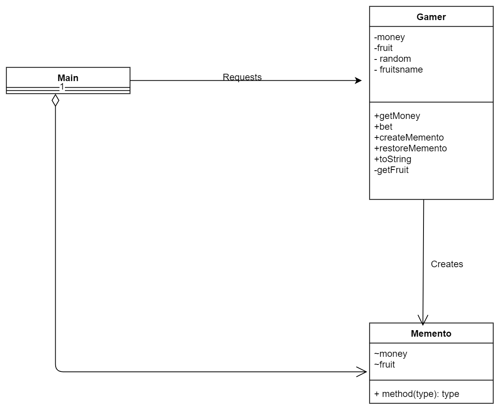
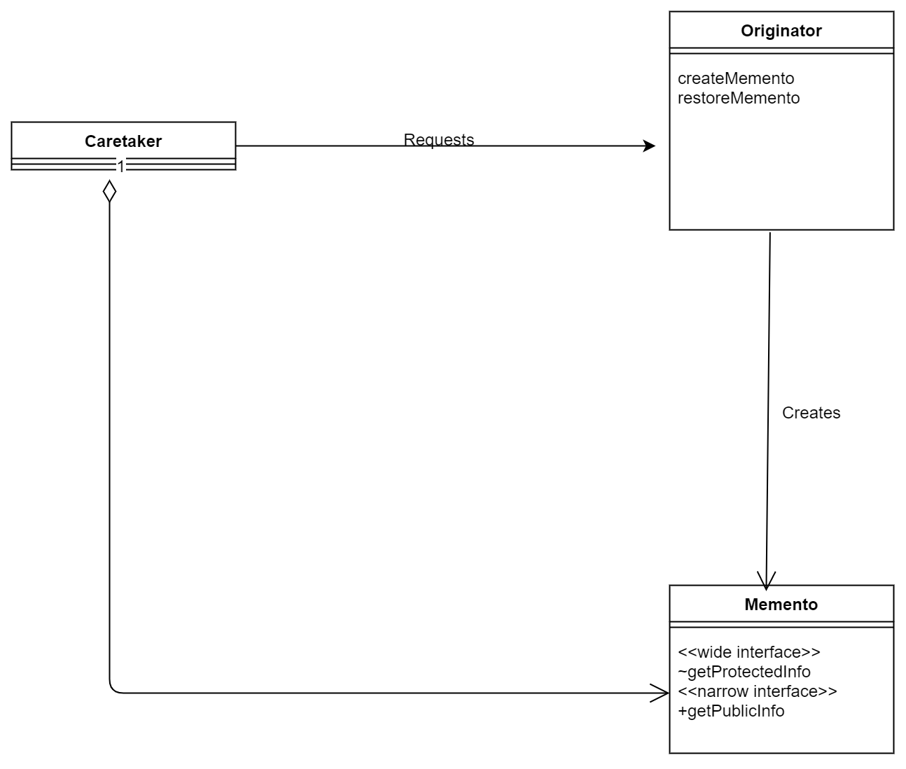

# Memento(备忘录模式)

有没有想过如何实现如下功能？Memento模式可以，本质上是通过保存不同时期的对象来实现。
- Undo(撤销)
- Redo(重做)
- History(历史记录)
- Snapshot(快照)


> 示例类图 

包 | 名字 | 说明 
----|----|-----
game | Memento | 表示Gamer状态的类
game | Gamer | 表示游戏主人公的类。它会生成Memento的实例。
无 | Main | 进行游戏的类。它会事先保存Memento的实例，之后会根据需要恢复Gamer的状态。

---


---

**`Main.java`**

我感觉`Main.java`是Memento模式的一个框架(**写了什么时候应该回退**)，而Memento和Gamer则是组成框架的部件(**`Gamer`应该怎么玩。而`Memento` 表示一个Gamer状态的类**)。
```java
public static void main(String[] args) {
    Gamer gamer = new Gamer(100);               // 最初的所持金钱数为100
    Memento memento = gamer.createMemento();    // 保存最初的状态
    for (int i = 0; i < 100; i++) {
        System.out.println("==== " + i);        // 显示掷骰子的次数
        System.out.println("当前状态:" + gamer);    // 显示主人公现在的状态

        gamer.bet();    // 进行游戏 

        System.out.println("所持金钱为" + gamer.getMoney() + "元。");

        // 决定如何处理Memento
        if (gamer.getMoney() > memento.getMoney()) {
            System.out.println("    （所持金钱增加了许多，因此保存游戏当前的状态）");
            memento = gamer.createMemento();
        } else if (gamer.getMoney() < memento.getMoney() / 2) {
            System.out.println("    （所持金钱减少了许多，因此将游戏恢复至以前的状态）");
            gamer.restoreMemento(memento);
        }

        // 等待一段时间
        try {
            Thread.sleep(1000);
        } catch (InterruptedException e) {
        }
        System.out.println("");
    }
}
```

**访问控制符的运用**

只有一个public 对外接口，其余的是default，只能同package下能用。这里我能感受到设计模式对访问控制符的要求严谨性 。

```java
public class Memento {
    int money; // 所持金钱
    ArrayList<String> fruits; // 当前获得的水果

    public int getMoney() { // 获取当前所持金钱（narrow interface）
        return money;
    }

    Memento(int money) { // 构造函数(wide interface)
        this.money = money;
        this.fruits = new ArrayList<>();
    }

    void addFruit(String fruit) { // 添加水果(wide interface)
        fruits.add(fruit);
    }

    List<String> getFruits() { // 获取当前所持所有水果（wide interface）
        return (List<String>) fruits.clone();
    }
}
```

> 抽象类图

---


---