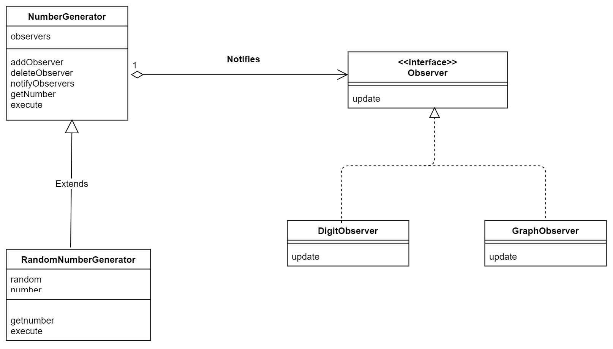
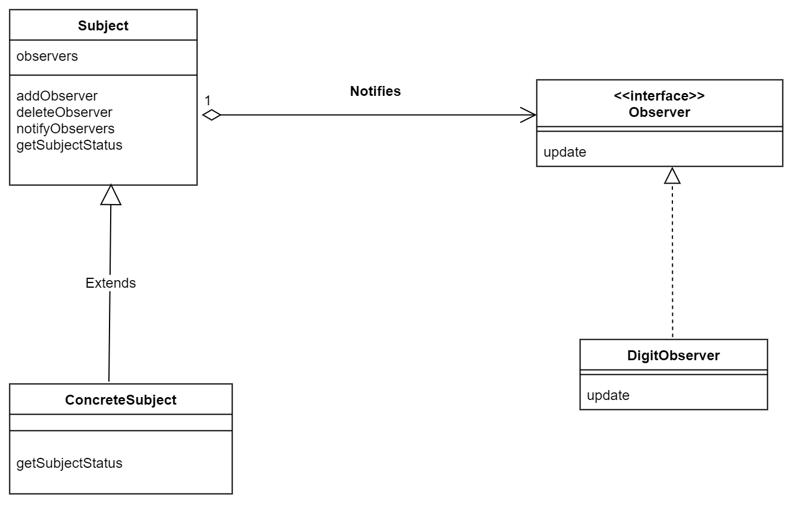

# Observer(观察者模式)

> 示例类图
名字 | 说明 
Observer | 表示观察者的接口
NumberGenerator  | 表示生成数值的对象的抽象类
RandomNumberGenerator | 生成随机数的类
DigitObserver | 表示以数字形式显示数值的类
GraphObserver | 表示以简单的图示形式显示数值的类
Main | 测试程序的类

---

---

**观察者是怎么观察的？**

其实不是观察者把把被观察对象聚集在一起，而是被观察对象 把观察者聚集在一起。
1. 被观察的，主动添加Observer，自己发生变化时，通知notify观察者
2. 观察者再update显示

```java
NumberGenerator generator = new RandomNumberGenerator();
Observer observer1 = new DigitObserver();
Observer observer2 = new GraphObserver();
generator.addObserver(observer1);
generator.addObserver(observer2);
```

被观察对象，如何添加Observer
```java
private ArrayList<Observer> observers = new ArrayList<>(); // 保存Observer们

public void addObserver(Observer observer) { // 注册Observer
    observers.add(observer);
}

public void deleteObserver(Observer observer) { // 删除Observer
    observers.remove(observer);
}

public void notifyObservers() { // 向Observer发送通知
    Iterator<Observer> it = observers.iterator();
    while (it.hasNext()) {
        Observer o = (Observer) it.next();
        o.update(this);
    }
}
```

这个示例中，也用到Template Method模式(**父类写好的算法**)
```java
public void notifyObservers() { // 向Observer发送通知
    Iterator<Observer> it = observers.iterator();
    while (it.hasNext()) {
        Observer o = (Observer) it.next();
        o.update(this);
    }
}
```

> 抽象类图

---

---