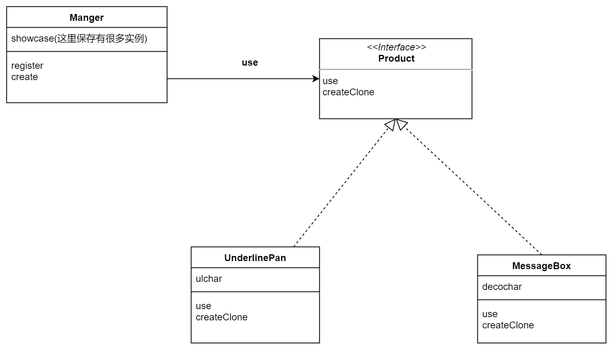
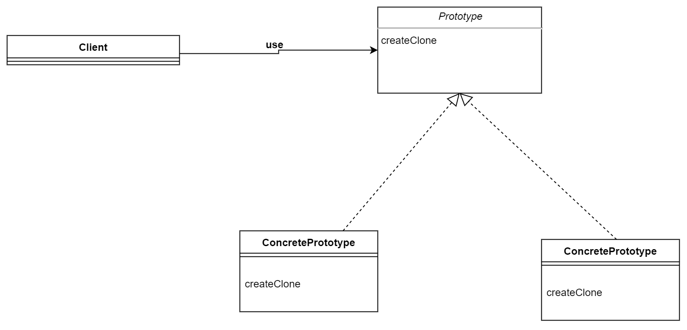

### Prototype（暂且叫复印机模式）

>例子类图

---

---

**关键**

1. Manager的showcase中保存有许多实例
2. 假设有这么一种情况，new一个对象很麻烦，而直接复制一份比较简单，这时候就可以通过Manager中的showcase返回。

**疑惑**

书中提到了Product要实现Clonable接口，这样对象就可以完成自我复制(就是自己调用自己的方法clone，就可以返回一个跟自己一样的对象)。**但是** 是否真的有必要？因为Manager的showcase都保存了注册进来的各种对象了。

**注意**

且不讨论用clone是否有必要。但是如果想要完成对象的复制(**不是对象引用的复制**)，在java中则必须要实现Cloneable接口，或者Cloneable的子接口。

但是这种对象的复制依旧是浅复制 ，只会复制一些实例和引用。比如如果有数组，那么只会复制数组的引用，而不是整个数组。(这里的表述可能不太清楚)

> 抽象类图

---

---