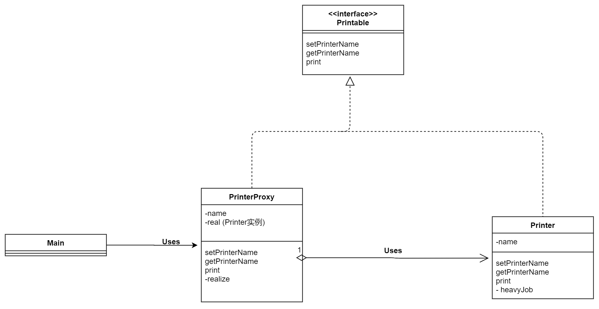
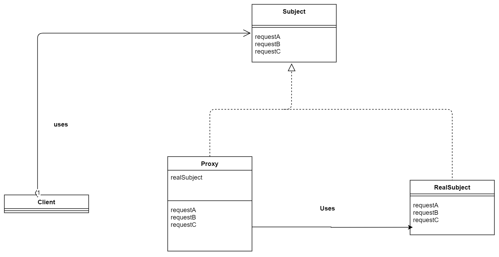

# Proxy(代理模式)
核心要点：只在必要时生成实例 
- 当不需要本人工作时，可以寻求代理人完成
- 当代理人遇到无法自己解决的事情时，就会去找本人

> 示例程序

名字 | 说明
----|----
Printer | 表示带名字的打印机的类(本人)
Printable | Printer和PrinterProxy的共同接口
PrinterProxy | 表示带名字的打印机的类(代理人)
Main | 测试程序行为的类

---

---

**只在必要时生成实例**

**其实这一点在示例代码中，体现和感受都不深刻。** 但是书本给了一个Wrod的编辑器例子。如果一个文档有许多图片，在打开的时候一下子加载全部图片的话会比较慢。如果是使用代理模式，那么只在快要浏览到某张图片时，**才生成对应的实例**，或者要求本人出面。总的来说，只在必要时生成实例，就可以提升处理速度 。

**代理与委托**

现实中应该是本人委托代理人，去完成代理事情。但是在代码中，却是代理人委托本人，去完成一些代理人不能完成的任务，代理的一部分体现在Main直接使用代理。

> 抽象类图

---

---

