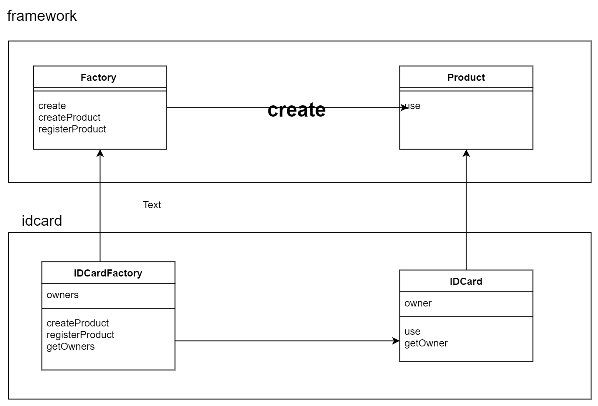

### Singleton(单例模式)
只能生成一个实例，需要用到private和static，这个一般人都知道。但是有一点比较新颖的是，这个例子是在声明一个static对象就直接new了，而不是在getInstance的时候再new，因为考虑到了多线程的问题。

---


---

- private的构造方法
- private、static的对象，以及static的getInstance方法

```java
在实现方面，还是有点出乎意料，是直接new好一个static对象，而不是getInstance再new,因为考虑到了多线程问题。
public class Singleton {
    private static Singleton singleton = new Singleton();

    private Singleton() {
        System.out.println("生成一个实例");
    }

    public static Singleton getInstance() {
        return singleton;
    }
}
```