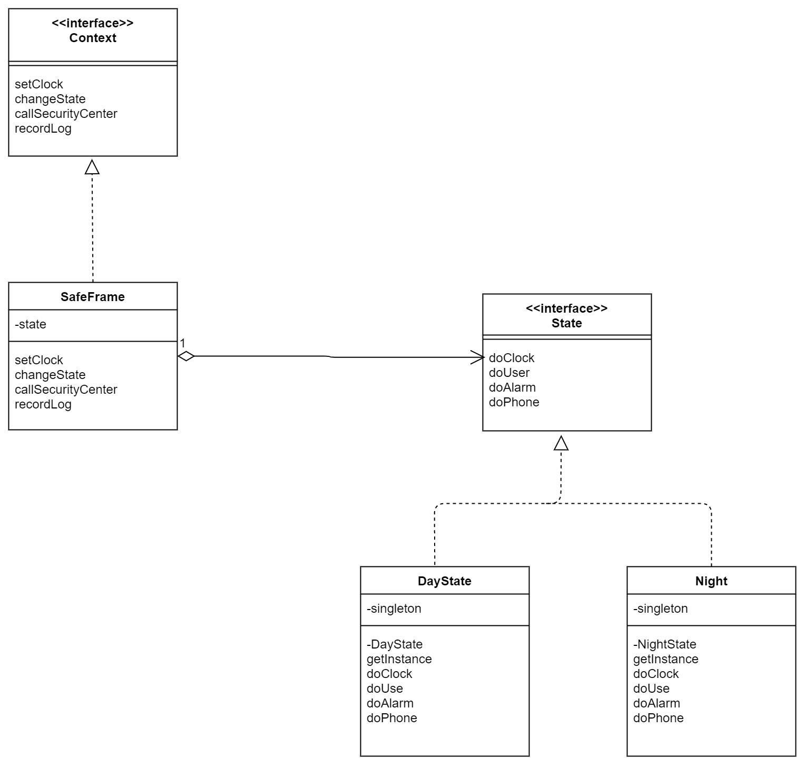

# State(状态模式)

> 示例类图

书中举了一个金库警报系统 的例子，说起来有不如直接看书，所以这里不赘述，只是记录一下我觉得的要点。

名字 | 说明
----|----
State | 表示金库状态的接口
DayState | 表示“白天”状态的类。实现Sate接口
NightState | 表示“晚上”状态的类。实现State接口
Context | 表示管理金库状态，并与警报中心联系的接口
SafeFrame | 实现了Context接口。内部有按钮等GUI显示
Main | 测试程序行为的类


---


---

书上对State模式和非State模式的伪代码做了一个对比

- 没有使用State模式的伪代码

```text
警报系统的类{
    
    使用金库时被调用的方法(){
        if(白天){
            向警报中心报告使用记录
        }else if(晚上){
            向警报中心报告紧急事态
        }
    }
    
    警铃响起时被调用的方法(){
        向警报中心报告紧急事态
    }
    
    正常通话时被调用的方法(){
        if(白天){
            呼叫警报中心
        }else if(晚上){
            呼叫警报中心的留言电话
        }
    }
}
```

- 使用了State模式的伪代码
```text
表示白天的状态的类{
    使用金库时被调用的方法(){
        向警报中心报告使用记录
    }
    警铃响起时被调用的方法(){
        向警报中心报告紧急事态
    }
    正常通话呼叫时被调用的方法(){
        呼叫警报中心
    }
}

表示晚上的状态的类{
    
    使用金库时被调用的方法(){
        向警报中心报告紧急事态
    }
    警铃响起时被调用的方法(){
        向警报中心报告紧急事态
    }
    正常通话呼叫时被调用的方法(){
        呼叫警报中心的留言电话
    }
}
```

使用了State模式之后，我觉得代码肯定会变得简洁，并且很符合面向对象的思想。

**具体的一些状态是怎么切换的呢?(SafeFrame.java) 应当是谁来管理状态迁移？**
```java
public void setClock(int hour) {
    String clockstring = "现在时间是";
    if (hour < 10) {
        clockstring += "0" + hour + ":00";
    } else {
        clockstring += hour + ":00";
    }
    System.out.println(clockstring);
    textClock.setText(clockstring);
    state.doClock(this, hour); //通过调用state对象的doClock()进行时间设置
}

// 改变状态
public void changeState(State state) {
    System.out.println("从" + this.state + "状態变为了" + state + "状态。");
    this.state = state;
}
```

```java
public void doClock(Context context, int hour) {    // 设置时间
    if (9 <= hour && hour < 17) {
        context.changeState(DayState.getInstance());
    }
}
//State反过来调用，context的changeState
//其实我也不太适应这种，你调用我，我又反过来调用你，这种方式
```

**书中特别讨论了应该由谁来管理状态的改变**
- 优点是看起来会很简洁，什么时候状态会改变，只要查看其中一个ConcreteState即可。
- 缺点是，每个ConcreteState需要知道其它ConcreteState，增加了一定的耦合度。

书本对于状态管理这点，还提到一些其它方案。但是讨论不深。
- Context可以使用Mediator模式
- 或者使用状态迁移表 ，根据输入输出判断下一个状态。


不需要判断对象的状态，直接传对象，让对象去执行方法。(之所以可以直接传对象，是因为每次都会检查State是否正确，然后就可以放心让State调用方法了)
```java
if (e.getSource() == buttonUse) { // 金库使用按钮
    state.doUse(this);
} else if (e.getSource() == buttonAlarm) { // 按下警铃按钮
    state.doAlarm(this);
} else if (e.getSource() == buttonPhone) { // 正常通话按钮
    state.doPhone(this);
} else if (e.getSource() == buttonExit) { // 结束按钮
    System.exit(0);
```

> 抽象类图

---


---