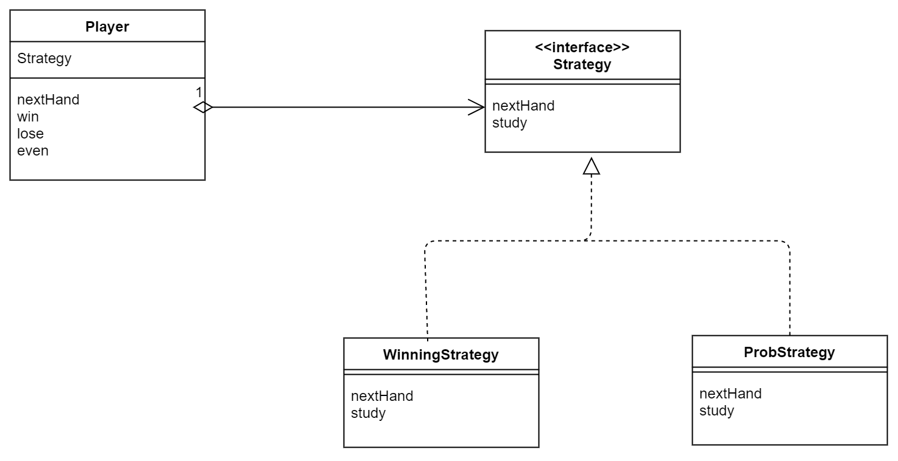
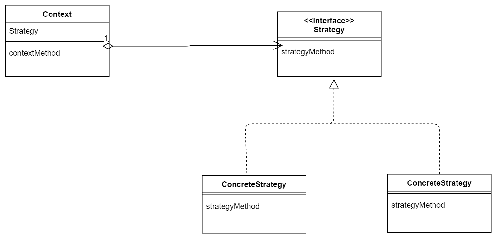

# strategy(策略)


> 示例类图

---


---

整体上很容易理解Strategy，所以重点会说一下具体的例子。

**Main**

大致的一个使用流程是
> 1. 在new player的同时，指定Strategy
> 2. 根据player的nextHand的返回结果，比较胜负

```java
int seed1 = Integer.parseInt(args[0]);
int seed2 = Integer.parseInt(args[1]);
Player player1 = new Player("Taro", new WinningStrategy(seed1));
Player player2 = new Player("Hana", new ProbStrategy(seed2));
for (int i = 0; i < 10000; i++) {
    Hand nextHand1 = player1.nextHand();
    Hand nextHand2 = player2.nextHand();
    if (nextHand1.isStrongerThan(nextHand2)) {
        System.out.println("Winner:" + player1);
        player1.win();
        player2.lose();
    } else if (nextHand2.isStrongerThan(nextHand1)) {
        System.out.println("Winner:" + player2);
        player1.lose();
        player2.win();
    } else {
        System.out.println("Even...");
        player1.even();
        player2.even();
    }
}
```

**Hand**

有一些点是值得关注的
> 1. Hand里面有一些statci的Hand实例
> 2. 并且石头剪刀布，可以用数学的方法展示出来

```java
public class Hand {
    public static final int HANDVALUE_GUU = 0; // 表示石头的值
    public static final int HANDVALUE_CHO = 1; // 表示剪刀的值
    public static final int HANDVALUE_PAA = 2; // 表示布的值
    public static final Hand[] hand = { // 表示猜拳中3种手势的实例
            new Hand(HANDVALUE_GUU), new Hand(HANDVALUE_CHO), new Hand(HANDVALUE_PAA), };
    private static final String[] name = { // 表示猜拳中手势所对应的字符串
            "石头", "剪刀", "布", };
    private int handvalue; // 表示猜拳中出的手势的值

    private Hand(int handvalue) {
        this.handvalue = handvalue;
    }

    public static Hand getHand(int handvalue) { // 根据手势的值获取其对应的实例
        return hand[handvalue];
    }


    public boolean isStrongerThan(Hand h) { // 如果this胜了h则返回true
        return fight(h) == 1;
    }

    public boolean isWeakerThan(Hand h) { // 如果this输给了h则返回true
        return fight(h) == -1;
    }

    private int fight(Hand h) { // 计分：平0, 胜1, 负-1
        if (this.handvalue == h.handvalue) {
            return 0;
        } else if ((this.handvalue + 1) % 3 == h.handvalue) {
            return 1;
        } else {
            return -1;
        }
    }
    public String toString() { // 转换为手势值所对应的字符串
        return name[handvalue];
    }
}
```

**WinningStrategy** 
> 1. 用了一个变量来判断上一局有没有胜利，而且对于第一局这种特殊情况也是适用。

```java
public class WinningStrategy implements Strategy {

    private Random random;
    private boolean won = false;
    private Hand preHand;

    public WinningStrategy(int seed) {
        random = new Random(seed);
    }

    @Override
    public Hand nextHand() {
        if (!won) {
            preHand = Hand.getHand(random.nextInt(3));
        }
        return preHand;
    }

    @Override
    public void study(boolean win) {
        won = win;
    }

}
```

**ProbStrategy**
> 1. 第一局应该是等概率地从石头剪刀布中出。而代码中也确实能把这种特殊情况统一化，体现在数组中的初始化。
> 2. history[][]记录的其实是history[上上局手势][上局手势]

```java
public class ProbStrategy implements Strategy {
    private Random random;
    private int prevHandValue = 0;
    private int currentHandValue = 0;
    private int[][] history = { { 1, 1, 1 }, { 1, 1, 1 }, { 1, 1, 1 } };

    public ProbStrategy(int seed) {
        random = new Random(seed);
    }

    public Hand nextHand() {
        int bet = random.nextInt(getSum(currentHandValue));
        int handvalue = 0;
        if (bet < history[currentHandValue][0])
            handvalue = 0;
        else if (bet > history[currentHandValue][0] && bet < history[currentHandValue][1])
            handvalue = 1;
        else
            handvalue = 2;
        prevHandValue = currentHandValue;
        currentHandValue = handvalue;
        return Hand.getHand(handvalue);
    }

    private int getSum(int hv) {
        int sum = 0;
        for (int i = 0; i < 3; i++) {
            sum += history[hv][i];
        }
        return sum;
    }

    public void study(boolean win) {
        if (win)
            history[prevHandValue][currentHandValue]++;
        else {
            history[prevHandValue][(currentHandValue + 1) % 3]++;
            history[prevHandValue][(currentHandValue + 2) % 3]++;
        }
    }
}
```

> 抽象类图

---


---


我感觉跟Strategy最相似的是Adapter，都是可以很轻松地替换一些零部件。