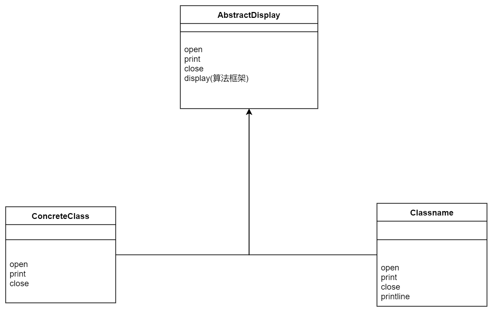
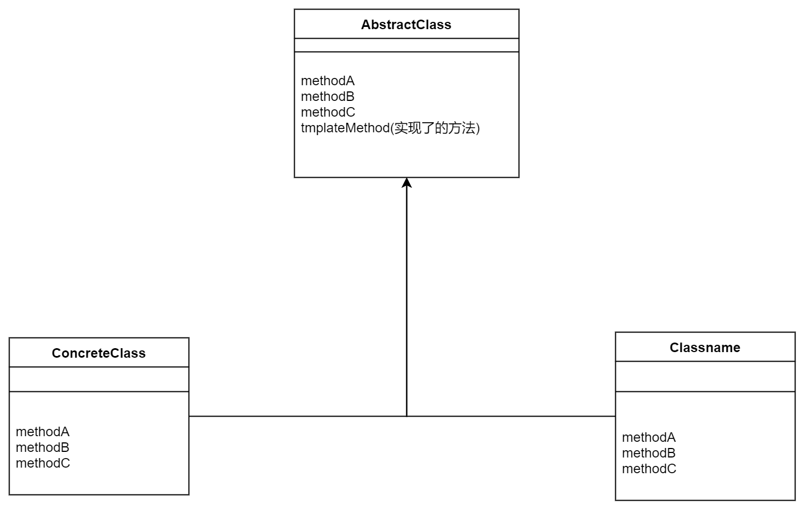

### Template method 模式
我愿意翻译为「模板方法模式」

主要特点是，定义了一个模板方法(java里是抽象类里的抽象方法)，然后由子类去实现具体的方法。需要注意的是，父类定义好了算法，即如何调用模板方法。

关键 （将具体处理交给子类(不是算法)）
- abstractMethod 一个步骤
- templateMethod 一个处理框架。算法

我记得书上是这么描写Template Method的，AbstractClass有抽象方法ABC，也有一个实现了的方法，templateMethod，它调用了ABC，我称之为「算法」方法。

也就是说，父类定义了具体的处理框架，templateMethod,子类去实现每个步骤是干什么的。

---
> 示例程序类图

> 对应抽象类图

