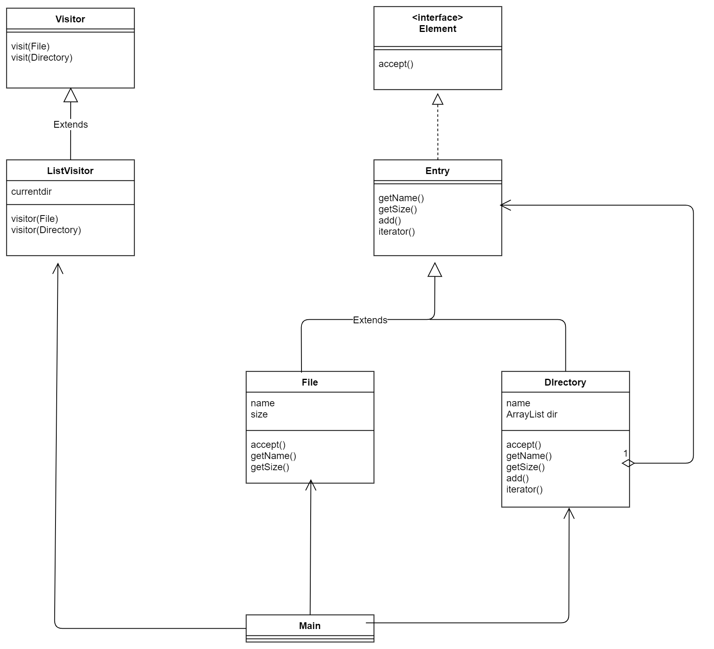
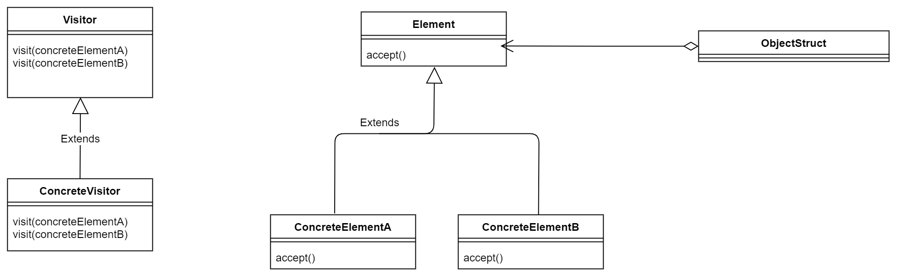

# Visitor(访问者)
书上的描述是数据结构与处理分离开来 。具体我也不好总结，还是看一下例子吧。

> 示例类图

名字 | 说明
-----|-----
Visitor | 表示访问者的抽象类
Element | 表示数据结构的接口
ListVisitor |Visitor的子类，显示文件和文件夹。(处理数据的)
Entry | File类和Directory类的父类，抽象类，实现了Element接口
File | 表示文件的类
Directory | 表示文件夹的类
FileTreatmentException | 表示向文件中add时发生的异常的类
Main  | 测试程序的类

---


---

有些代码间的调用感觉挺绕的 

1. 数据结构要主动接受Visitor，然后visitor再去调用visit方法
```
public class File

public void accept(Visitor v) {
    v.visit(this);
}
```

2. ListVisitor是如何打印目录的？

它是先打印当前目录了，然后再循环下去打印其它目录，感觉好像递归 。同时多用一个字符串临时存储currentdir，然后就可以递归下去了。
```java
public void visit(Directory directory) {
    System.out.println(currentdir + "/" + directory);
    String savedir = currentdir;
    currentdir = currentdir + "/" + directory.getName();
    Iterator<Entry> it = directory.iterator();
    while (it.hasNext()) {
        Entry entry = it.next();
        entry.accept(this);
    }
    currentdir = savedir;
}
```

3. 为什么要有accept和visit很绕的调用方式？

书本是这样解释的，为了将处理从数据结构中分离出来。比如我想对File和Directory增加新的处理，这时候就可以新增一些Visitor，而不用修改File和Directory。这也符合开闭原则 ，对扩展是开放的，对修改是关闭的。

个人感觉Visitor和Adapter是挺像的。但是我也没有深究了。

> 抽象类图
这个ObjectStruct的一个必要性，我也不太了解。

---


---